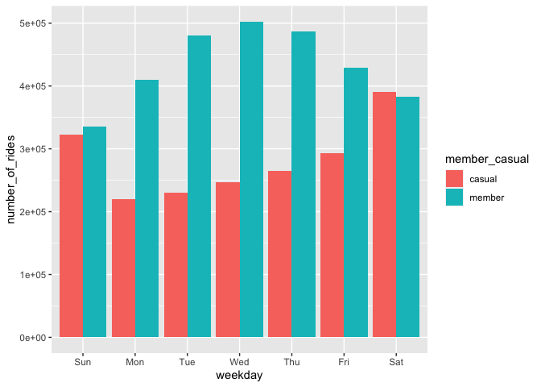
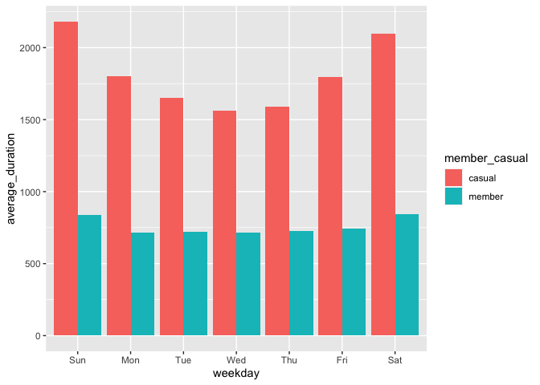
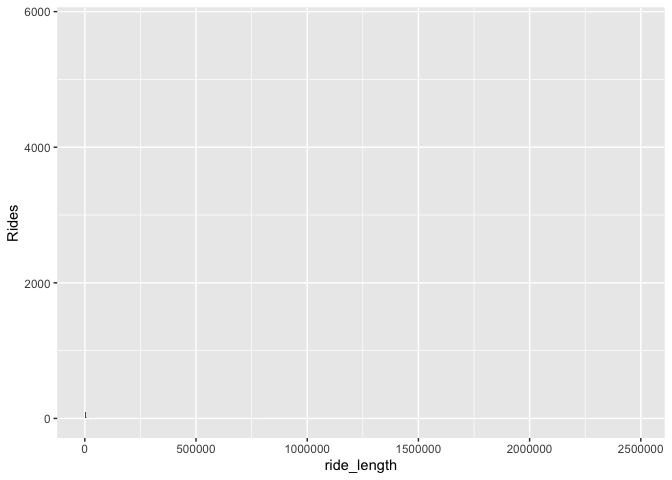

README
================
Aaron
2023-06-20

# Google Certificate in Data Analytics

## Capstone Project \#1

### Introduction

This is the first of several projects for practicing and showcasing what
I have learned throughout this course. In this case study, my main focus
is to develop a solid R Markdown document for ease of creating a report
that is easily followed by colleagues and stakeholders.

#### Notes

These data are provided under [this
license](https://ride.divvybikes.com/data-license-agreement). Since the
dataset(s) are extremely large, I intend to compile and clean them in
BigQuery and/or R. If there ends up being a smaller dataset, I might
switch to a spreadsheet, unless I have already laid the necessary
infrastructure in R.

## Business Goals (Ask)

Director of Marketing, Lily Moreno has asked for analysis of Cyclistic’s
internal data, with the overarching goal of converting casual users into
annual subscribers. She has asked three specific questions:

- How do annual members and casual riders use Cyclistic bikes
  differently?

- Why would casual riders buy Cyclistic annual memberships?

- How can Cyclistic use digital media to influence casual riders to
  become members?

For this report, we will focus on the first question and analyze the
differences in use patterns by casual riders and annual members.

## Data Preparation (Prepare/Process)

Ride data from June 2022 to May 2023 were retrieved from Cyclistic’s
internal database. (Note: the data are actually made available by
Motivate International Inc. via the previous link.)

The data files contain tables with about 200,000 to 1,000,000 rows, so
Spreadsheets will be too bulky for the initial cleaning and preparation.

#### These are the necessary packages for this analysis.

``` r
library(tidyverse)
```

    ## ── Attaching core tidyverse packages ──────────────────────── tidyverse 2.0.0 ──
    ## ✔ dplyr     1.1.2     ✔ readr     2.1.4
    ## ✔ forcats   1.0.0     ✔ stringr   1.5.0
    ## ✔ ggplot2   3.4.2     ✔ tibble    3.2.1
    ## ✔ lubridate 1.9.2     ✔ tidyr     1.3.0
    ## ✔ purrr     1.0.1     
    ## ── Conflicts ────────────────────────────────────────── tidyverse_conflicts() ──
    ## ✖ dplyr::filter() masks stats::filter()
    ## ✖ dplyr::lag()    masks stats::lag()
    ## ℹ Use the conflicted package (<http://conflicted.r-lib.org/>) to force all conflicts to become errors

``` r
library(readr)
library(lubridate)
library(ggplot2)
library(knitr)
getwd()
```

    ## [1] "/Users/aaronkeeney/Documents/Data Analytics Projects/Cyclistic"

``` r
setwd("~/Desktop/Coding Projects/Capstone_Cyclistic_Raw_Data/Cyclistic_csv_files")
```

#### Importing the necessary data.

##### Note: changed September from “trippublicdata” to “tripdata” for consistency.

``` r
setwd("~/Desktop/Coding Projects/Capstone_Cyclistic_Raw_Data/Cyclistic_csv_files")
Jun_2022 <- read_csv("202206-divvy-tripdata.csv")
```

    ## Rows: 769204 Columns: 13
    ## ── Column specification ────────────────────────────────────────────────────────
    ## Delimiter: ","
    ## chr  (7): ride_id, rideable_type, start_station_name, start_station_id, end_...
    ## dbl  (4): start_lat, start_lng, end_lat, end_lng
    ## dttm (2): started_at, ended_at
    ## 
    ## ℹ Use `spec()` to retrieve the full column specification for this data.
    ## ℹ Specify the column types or set `show_col_types = FALSE` to quiet this message.

``` r
Jul_2022 <- read_csv("202207-divvy-tripdata.csv")
```

    ## Rows: 823488 Columns: 13
    ## ── Column specification ────────────────────────────────────────────────────────
    ## Delimiter: ","
    ## chr  (7): ride_id, rideable_type, start_station_name, start_station_id, end_...
    ## dbl  (4): start_lat, start_lng, end_lat, end_lng
    ## dttm (2): started_at, ended_at
    ## 
    ## ℹ Use `spec()` to retrieve the full column specification for this data.
    ## ℹ Specify the column types or set `show_col_types = FALSE` to quiet this message.

``` r
Aug_2022 <- read_csv("202208-divvy-tripdata.csv")
```

    ## Rows: 785932 Columns: 13
    ## ── Column specification ────────────────────────────────────────────────────────
    ## Delimiter: ","
    ## chr  (7): ride_id, rideable_type, start_station_name, start_station_id, end_...
    ## dbl  (4): start_lat, start_lng, end_lat, end_lng
    ## dttm (2): started_at, ended_at
    ## 
    ## ℹ Use `spec()` to retrieve the full column specification for this data.
    ## ℹ Specify the column types or set `show_col_types = FALSE` to quiet this message.

``` r
Sep_2022 <- read_csv("202209-divvy-tripdata.csv")
```

    ## Rows: 701339 Columns: 13
    ## ── Column specification ────────────────────────────────────────────────────────
    ## Delimiter: ","
    ## chr  (7): ride_id, rideable_type, start_station_name, start_station_id, end_...
    ## dbl  (4): start_lat, start_lng, end_lat, end_lng
    ## dttm (2): started_at, ended_at
    ## 
    ## ℹ Use `spec()` to retrieve the full column specification for this data.
    ## ℹ Specify the column types or set `show_col_types = FALSE` to quiet this message.

``` r
Oct_2022 <- read_csv("202210-divvy-tripdata.csv")
```

    ## Rows: 558685 Columns: 13
    ## ── Column specification ────────────────────────────────────────────────────────
    ## Delimiter: ","
    ## chr  (7): ride_id, rideable_type, start_station_name, start_station_id, end_...
    ## dbl  (4): start_lat, start_lng, end_lat, end_lng
    ## dttm (2): started_at, ended_at
    ## 
    ## ℹ Use `spec()` to retrieve the full column specification for this data.
    ## ℹ Specify the column types or set `show_col_types = FALSE` to quiet this message.

``` r
Nov_2022 <- read_csv("202211-divvy-tripdata.csv")
```

    ## Rows: 337735 Columns: 13
    ## ── Column specification ────────────────────────────────────────────────────────
    ## Delimiter: ","
    ## chr  (7): ride_id, rideable_type, start_station_name, start_station_id, end_...
    ## dbl  (4): start_lat, start_lng, end_lat, end_lng
    ## dttm (2): started_at, ended_at
    ## 
    ## ℹ Use `spec()` to retrieve the full column specification for this data.
    ## ℹ Specify the column types or set `show_col_types = FALSE` to quiet this message.

``` r
Dec_2022 <- read_csv("202212-divvy-tripdata.csv")
```

    ## Rows: 181806 Columns: 13
    ## ── Column specification ────────────────────────────────────────────────────────
    ## Delimiter: ","
    ## chr  (7): ride_id, rideable_type, start_station_name, start_station_id, end_...
    ## dbl  (4): start_lat, start_lng, end_lat, end_lng
    ## dttm (2): started_at, ended_at
    ## 
    ## ℹ Use `spec()` to retrieve the full column specification for this data.
    ## ℹ Specify the column types or set `show_col_types = FALSE` to quiet this message.

``` r
Jan_2023 <- read_csv("202301-divvy-tripdata.csv")
```

    ## Rows: 190301 Columns: 13
    ## ── Column specification ────────────────────────────────────────────────────────
    ## Delimiter: ","
    ## chr  (7): ride_id, rideable_type, start_station_name, start_station_id, end_...
    ## dbl  (4): start_lat, start_lng, end_lat, end_lng
    ## dttm (2): started_at, ended_at
    ## 
    ## ℹ Use `spec()` to retrieve the full column specification for this data.
    ## ℹ Specify the column types or set `show_col_types = FALSE` to quiet this message.

``` r
Feb_2023 <- read_csv("202302-divvy-tripdata.csv")
```

    ## Rows: 190445 Columns: 13
    ## ── Column specification ────────────────────────────────────────────────────────
    ## Delimiter: ","
    ## chr  (7): ride_id, rideable_type, start_station_name, start_station_id, end_...
    ## dbl  (4): start_lat, start_lng, end_lat, end_lng
    ## dttm (2): started_at, ended_at
    ## 
    ## ℹ Use `spec()` to retrieve the full column specification for this data.
    ## ℹ Specify the column types or set `show_col_types = FALSE` to quiet this message.

``` r
Mar_2023 <- read_csv("202303-divvy-tripdata.csv")
```

    ## Rows: 258678 Columns: 13
    ## ── Column specification ────────────────────────────────────────────────────────
    ## Delimiter: ","
    ## chr  (7): ride_id, rideable_type, start_station_name, start_station_id, end_...
    ## dbl  (4): start_lat, start_lng, end_lat, end_lng
    ## dttm (2): started_at, ended_at
    ## 
    ## ℹ Use `spec()` to retrieve the full column specification for this data.
    ## ℹ Specify the column types or set `show_col_types = FALSE` to quiet this message.

``` r
Apr_2023 <- read_csv("202304-divvy-tripdata.csv")
```

    ## Rows: 426590 Columns: 13
    ## ── Column specification ────────────────────────────────────────────────────────
    ## Delimiter: ","
    ## chr  (7): ride_id, rideable_type, start_station_name, start_station_id, end_...
    ## dbl  (4): start_lat, start_lng, end_lat, end_lng
    ## dttm (2): started_at, ended_at
    ## 
    ## ℹ Use `spec()` to retrieve the full column specification for this data.
    ## ℹ Specify the column types or set `show_col_types = FALSE` to quiet this message.

``` r
May_2023 <- read_csv("202305-divvy-tripdata.csv")
```

    ## Rows: 604827 Columns: 13
    ## ── Column specification ────────────────────────────────────────────────────────
    ## Delimiter: ","
    ## chr  (7): ride_id, rideable_type, start_station_name, start_station_id, end_...
    ## dbl  (4): start_lat, start_lng, end_lat, end_lng
    ## dttm (2): started_at, ended_at
    ## 
    ## ℹ Use `spec()` to retrieve the full column specification for this data.
    ## ℹ Specify the column types or set `show_col_types = FALSE` to quiet this message.

#### After using colnames() and str() to ensure matching datasets,

#### the above datasets were merged.

``` r
all_trips <- rbind(Jun_2022, Jul_2022, Aug_2022, Sep_2022, Oct_2022, 
                       Nov_2022, Dec_2022, Jan_2023, Feb_2023, Mar_2023,
                       Apr_2023, May_2023)
```

#### A quick snapshot for orientation and an idea of scale.

``` r
str(all_trips)
```

    ## spc_tbl_ [5,829,030 × 13] (S3: spec_tbl_df/tbl_df/tbl/data.frame)
    ##  $ ride_id           : chr [1:5829030] "600CFD130D0FD2A4" "F5E6B5C1682C6464" "B6EB6D27BAD771D2" "C9C320375DE1D5C6" ...
    ##  $ rideable_type     : chr [1:5829030] "electric_bike" "electric_bike" "electric_bike" "electric_bike" ...
    ##  $ started_at        : POSIXct[1:5829030], format: "2022-06-30 17:27:53" "2022-06-30 18:39:52" ...
    ##  $ ended_at          : POSIXct[1:5829030], format: "2022-06-30 17:35:15" "2022-06-30 18:47:28" ...
    ##  $ start_station_name: chr [1:5829030] NA NA NA NA ...
    ##  $ start_station_id  : chr [1:5829030] NA NA NA NA ...
    ##  $ end_station_name  : chr [1:5829030] NA NA NA NA ...
    ##  $ end_station_id    : chr [1:5829030] NA NA NA NA ...
    ##  $ start_lat         : num [1:5829030] 41.9 41.9 41.9 41.8 41.9 ...
    ##  $ start_lng         : num [1:5829030] -87.6 -87.6 -87.7 -87.7 -87.6 ...
    ##  $ end_lat           : num [1:5829030] 41.9 41.9 41.9 41.8 41.9 ...
    ##  $ end_lng           : num [1:5829030] -87.6 -87.6 -87.6 -87.7 -87.6 ...
    ##  $ member_casual     : chr [1:5829030] "casual" "casual" "casual" "casual" ...
    ##  - attr(*, "spec")=
    ##   .. cols(
    ##   ..   ride_id = col_character(),
    ##   ..   rideable_type = col_character(),
    ##   ..   started_at = col_datetime(format = ""),
    ##   ..   ended_at = col_datetime(format = ""),
    ##   ..   start_station_name = col_character(),
    ##   ..   start_station_id = col_character(),
    ##   ..   end_station_name = col_character(),
    ##   ..   end_station_id = col_character(),
    ##   ..   start_lat = col_double(),
    ##   ..   start_lng = col_double(),
    ##   ..   end_lat = col_double(),
    ##   ..   end_lng = col_double(),
    ##   ..   member_casual = col_character()
    ##   .. )
    ##  - attr(*, "problems")=<externalptr>

``` r
ncol(all_trips)
```

    ## [1] 13

``` r
nrow(all_trips)
```

    ## [1] 5829030

#### Confirmation that there are only two labels for members.

``` r
categories <- unique(all_trips$member_casual)
number_of_categories <- length(categories)
list(categories)
```

    ## [[1]]
    ## [1] "casual" "member"

``` r
table(all_trips$member_casual)
```

    ## 
    ##  casual  member 
    ## 2312073 3516957

There are no extraneous values to be removed, although there will be
further cleaning of nonsensical values.

#### These next steps split the datetime column into more human time,

#### day, month, etc. Not entirely sure why format() could not extract the

#### day of the week, but the weekdays() function worked perfectly.

``` r
all_trips$date <- as.Date(all_trips$started_at)
all_trips$month <- format(as.Date(all_trips$date),"%m")
all_trips$day <- format(as.Date(all_trips$date),"%d")
all_trips$year <- format(as.Date(all_trips$date),"%Y")
all_trips$day_of_week <- weekdays(as.Date(all_trips$date))
```

#### Confirmation of the correct structure.

``` r
table(all_trips$month)
```

    ## 
    ##     01     02     03     04     05     06     07     08     09     10     11 
    ## 190301 190445 258678 426590 604827 769204 823488 785932 701339 558685 337735 
    ##     12 
    ## 181806

``` r
table(all_trips$day)
```

    ## 
    ##     01     02     03     04     05     06     07     08     09     10     11 
    ## 185443 203966 200387 185932 194943 191494 187339 174831 217826 223058 193855 
    ##     12     13     14     15     16     17     18     19     20     21     22 
    ## 184829 198115 190592 187407 183536 181083 189760 186216 192377 207504 189170 
    ##     23     24     25     26     27     28     29     30     31 
    ## 195979 189462 148955 186563 186932 192410 184221 183907 110938

``` r
table(all_trips$year)
```

    ## 
    ##    2022    2023 
    ## 4158189 1670841

``` r
table(all_trips$day_of_week)
```

    ## 
    ##    Friday    Monday  Saturday    Sunday  Thursday   Tuesday Wednesday 
    ##    848026    729223    908587    770189    878250    823517    871238

12 months, 31 days, 2 years, and 7 days of the week, as expected.

#### Calculating the ride length and ensuring the correct format.

``` r
all_trips$ride_length <- difftime(all_trips$ended_at, all_trips$started_at)
all_trips$ride_length <- as.numeric(as.character(all_trips$ride_length))
is.numeric(all_trips$ride_length)
```

    ## [1] TRUE

#### Need to remove negative trip lengths and quality control checks

#### This is the formula I used, as the method using an operator did not work.

#### After a dplyr update, the ! operator method worked perfectly well.

``` r
all_trips_v2 <- subset(all_trips, all_trips$ride_length > 0 
                       & all_trips$start_station_name != "HQ QR")
```

#### Here is the other possibility that I would like to compare for speed.

all_trips_v2 \<-
all_trips\[!(all_trips$start_station_name == "HQ QR"  | all_trips$ride_length\<0),\]

#### Just a quick check for oddities

``` r
summary(all_trips_v2$ride_length)
```

    ##    Min. 1st Qu.  Median    Mean 3rd Qu.    Max. 
    ##       1     343     603    1183    1081 2483235

This summary shows a large maximum value, so it is best to check for
outliers.

``` r
ride_length_outlier_check <- all_trips_v2 %>%
  arrange(desc(ride_length))
head(ride_length_outlier_check)
```

    ## # A tibble: 6 × 19
    ##   ride_id          rideable_type started_at          ended_at           
    ##   <chr>            <chr>         <dttm>              <dttm>             
    ## 1 7D4CB0DD5137CA9A docked_bike   2022-10-01 15:04:38 2022-10-30 08:51:53
    ## 2 94DD1FB2367EA8B6 docked_bike   2022-06-15 07:56:59 2022-07-10 04:57:37
    ## 3 70835A30C542BA2E docked_bike   2022-07-09 01:02:46 2022-08-01 19:11:35
    ## 4 3BFD0599F253B024 docked_bike   2022-07-09 01:03:19 2022-08-01 19:11:26
    ## 5 A256444CE831A7EE docked_bike   2022-07-09 01:02:45 2022-08-01 18:51:57
    ## 6 307CA01BAE3CC7E3 docked_bike   2023-01-08 11:08:52 2023-01-31 19:12:36
    ## # ℹ 15 more variables: start_station_name <chr>, start_station_id <chr>,
    ## #   end_station_name <chr>, end_station_id <chr>, start_lat <dbl>,
    ## #   start_lng <dbl>, end_lat <dbl>, end_lng <dbl>, member_casual <chr>,
    ## #   date <date>, month <chr>, day <chr>, year <chr>, day_of_week <chr>,
    ## #   ride_length <dbl>

From this quick analysis, we see that there are multiple ride lengths
over 2 million seconds. Note: in the above script, all the rider types
were casual, which may be significant. MAKE A VISUAL TO ILLUSTRATE
THIS!!! Show ride lengths, and frequency of certain bins—I think a
histogram with separate columns for members and casual riders. Or, two
separate histograms, kinda like a probability ditribution.

## Summary Statistics, Analysis, and Visualizations

#### Basic Overview: Mean, Median, Max, Min (In seconds)

``` r
mean(all_trips_v2$ride_length)
```

    ## [1] 1182.649

``` r
median(all_trips_v2$ride_length)
```

    ## [1] 603

``` r
max(all_trips_v2$ride_length)
```

    ## [1] 2483235

``` r
min(all_trips_v2$ride_length)
```

    ## [1] 1

``` r
sd(all_trips_v2$ride_length)
```

    ## [1] 11377.21

#### Summary Statistics, Separated by Rider Type

``` r
aggregate(all_trips_v2$ride_length ~ all_trips_v2$member_casual, FUN = length)
```

    ##   all_trips_v2$member_casual all_trips_v2$ride_length
    ## 1                     casual                  1967720
    ## 2                     member                  3026232

``` r
aggregate(all_trips_v2$ride_length ~ all_trips_v2$member_casual, FUN = mean)
```

    ##   all_trips_v2$member_casual all_trips_v2$ride_length
    ## 1                     casual                1844.4176
    ## 2                     member                 752.3535

``` r
aggregate(all_trips_v2$ride_length ~ all_trips_v2$member_casual, FUN = median)
```

    ##   all_trips_v2$member_casual all_trips_v2$ride_length
    ## 1                     casual                      768
    ## 2                     member                      521

``` r
aggregate(all_trips_v2$ride_length ~ all_trips_v2$member_casual, FUN = max)
```

    ##   all_trips_v2$member_casual all_trips_v2$ride_length
    ## 1                     casual                  2483235
    ## 2                     member                    93580

``` r
aggregate(all_trips_v2$ride_length ~ all_trips_v2$member_casual, FUN = min)
```

    ##   all_trips_v2$member_casual all_trips_v2$ride_length
    ## 1                     casual                        1
    ## 2                     member                        1

``` r
aggregate(all_trips_v2$ride_length ~ all_trips_v2$member_casual, FUN = sd)
```

    ##   all_trips_v2$member_casual all_trips_v2$ride_length
    ## 1                     casual                17961.456
    ## 2                     member                 1834.608

#### Number of Rides by Rider Type and Day of the Week (requested)

``` r
## Number of rides by rider type and day of the week
all_trips_v2 %>%
  mutate(weekday = wday(started_at, label=TRUE)) %>%
  group_by(member_casual, weekday) %>%
  summarise(number_of_rides = n(), average_duration = mean(ride_length)) %>%
  arrange(member_casual, weekday)
```

    ## `summarise()` has grouped output by 'member_casual'. You can override using the
    ## `.groups` argument.

    ## # A tibble: 14 × 4
    ## # Groups:   member_casual [2]
    ##    member_casual weekday number_of_rides average_duration
    ##    <chr>         <ord>             <int>            <dbl>
    ##  1 casual        Sun              322008            2181.
    ##  2 casual        Mon              219537            1802.
    ##  3 casual        Tue              229913            1654.
    ##  4 casual        Wed              247445            1561.
    ##  5 casual        Thu              265164            1588.
    ##  6 casual        Fri              292763            1794.
    ##  7 casual        Sat              390890            2094.
    ##  8 member        Sun              335506             839.
    ##  9 member        Mon              409435             714.
    ## 10 member        Tue              480681             722.
    ## 11 member        Wed              502344             718.
    ## 12 member        Thu              487275             725.
    ## 13 member        Fri              428644             744.
    ## 14 member        Sat              382347             846.

``` r
all_trips_v2 %>%
  mutate(weekday = wday(started_at, label=TRUE)) %>%
  group_by(member_casual, weekday) %>%
  summarise(number_of_rides = n(), average_duration = mean(ride_length)) %>%
  arrange(member_casual, weekday) %>%
  ggplot(aes(x=weekday, y=number_of_rides, fill=member_casual))+
  geom_col(position = "dodge")
```

    ## `summarise()` has grouped output by 'member_casual'. You can override using the
    ## `.groups` argument.

<!-- -->

#### Ride Duration by Rider Type and Day of the Week

``` r
all_trips_v2 %>%
  mutate(weekday = wday(started_at, label=TRUE)) %>%
  group_by(member_casual, weekday) %>%
  summarise(number_of_rides = n(), average_duration = mean(ride_length)) %>%
  arrange(member_casual, weekday) %>%
  ggplot(aes(x=weekday, y=average_duration, fill=member_casual))+
  geom_col(position = "dodge")
```

    ## `summarise()` has grouped output by 'member_casual'. You can override using the
    ## `.groups` argument.

<!-- -->

#### Distribution of Ride Lengths (working version)

``` r
all_trips_v2 %>%
  group_by(ride_length) %>%
  summarise(Rides=n()) %>%
ggplot(aes(x=ride_length, y = Rides)) +
  geom_col()
```

<!-- -->
