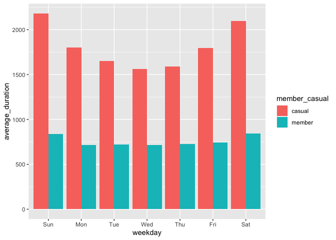
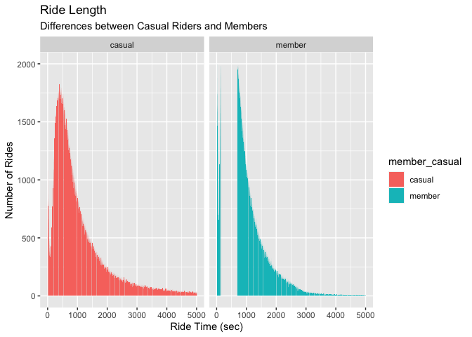
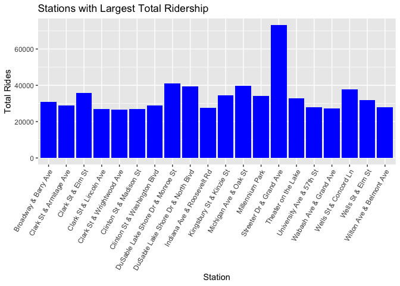
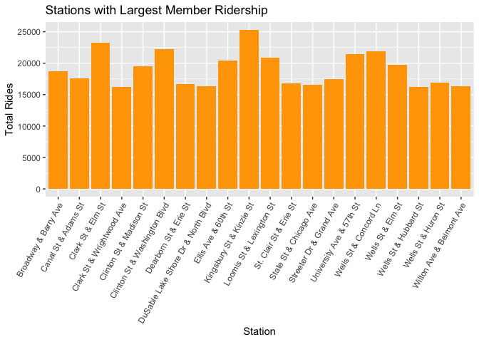
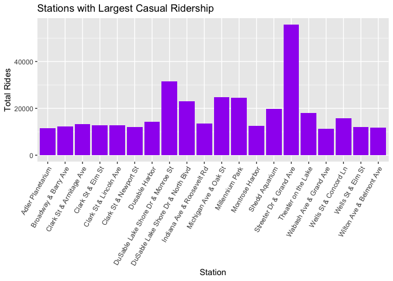

Google Certificate in Data Analytics
================
Aaron
2023-06-20

## Capstone Project \#1

### Introduction

This is the first of several projects for practicing and showcasing what
I have learned throughout this course. In this case study, my main focus
is to develop a solid R Markdown document for ease of creating a report
that is easily followed by colleagues and stakeholders.

#### Notes

These [data](https://divvy-tripdata.s3.amazonaws.com/index.html) are
provided under [this
license](https://ride.divvybikes.com/data-license-agreement). Since the
dataset(s) are extremely large, I intend to compile and clean them in
BigQuery and/or R. If there ends up being a smaller dataset, I might
switch to a spreadsheet, unless I have already laid the necessary
infrastructure in R.

Thank you to HanOostdijk for giving some
[advice](https://community.rstudio.com/t/rmarkdow-how-can-i-create-a-pdf-file-with-different-name-from-rmd/67879)
with knitting to git.

## Business Goals (Ask)

Director of Marketing, Lily Moreno has asked for analysis of Cyclistic’s
internal data, with the overarching goal of converting casual users into
annual subscribers. She has asked three specific questions:

- How do annual members and casual riders use Cyclistic bikes
  differently?

- Why would casual riders buy Cyclistic annual memberships?

- How can Cyclistic use digital media to influence casual riders to
  become members?

For this report, we will focus on the first question and analyze the
differences in use patterns by casual riders and annual members.

## Data Preparation (Prepare/Process)

Ride data from June 2022 to May 2023 were retrieved from Cyclistic’s
internal database. (Note: the data are actually made available by
Motivate International Inc. via the previous link.)

The data files contain tables with about 200,000 to 1,000,000 rows, so
Spreadsheets will be too bulky for the initial cleaning and preparation.

#### These are the necessary packages for this analysis.

``` r
library(tidyverse)
```

    ## ── Attaching core tidyverse packages ──────────────────────── tidyverse 2.0.0 ──
    ## ✔ dplyr     1.1.2     ✔ readr     2.1.4
    ## ✔ forcats   1.0.0     ✔ stringr   1.5.0
    ## ✔ ggplot2   3.4.2     ✔ tibble    3.2.1
    ## ✔ lubridate 1.9.2     ✔ tidyr     1.3.0
    ## ✔ purrr     1.0.1     
    ## ── Conflicts ────────────────────────────────────────── tidyverse_conflicts() ──
    ## ✖ dplyr::filter() masks stats::filter()
    ## ✖ dplyr::lag()    masks stats::lag()
    ## ℹ Use the conflicted package (<http://conflicted.r-lib.org/>) to force all conflicts to become errors

``` r
library(readr)
library(lubridate)
library(ggplot2)
library(knitr)
getwd()
```

    ## [1] "/Users/aaronkeeney/Documents/Data Analytics Projects/Cyclistic"

``` r
setwd("~/Desktop/Coding Projects/Capstone_Cyclistic_Raw_Data/Cyclistic_csv_files")
```

#### Importing the necessary data.

##### Note: changed September from “trippublicdata” to “tripdata” for consistency.

``` r
setwd("~/Desktop/Coding Projects/Capstone_Cyclistic_Raw_Data/Cyclistic_csv_files")
Jun_2022 <- read_csv("202206-divvy-tripdata.csv")
```

    ## Rows: 769204 Columns: 13
    ## ── Column specification ────────────────────────────────────────────────────────
    ## Delimiter: ","
    ## chr  (7): ride_id, rideable_type, start_station_name, start_station_id, end_...
    ## dbl  (4): start_lat, start_lng, end_lat, end_lng
    ## dttm (2): started_at, ended_at
    ## 
    ## ℹ Use `spec()` to retrieve the full column specification for this data.
    ## ℹ Specify the column types or set `show_col_types = FALSE` to quiet this message.

``` r
Jul_2022 <- read_csv("202207-divvy-tripdata.csv")
```

    ## Rows: 823488 Columns: 13
    ## ── Column specification ────────────────────────────────────────────────────────
    ## Delimiter: ","
    ## chr  (7): ride_id, rideable_type, start_station_name, start_station_id, end_...
    ## dbl  (4): start_lat, start_lng, end_lat, end_lng
    ## dttm (2): started_at, ended_at
    ## 
    ## ℹ Use `spec()` to retrieve the full column specification for this data.
    ## ℹ Specify the column types or set `show_col_types = FALSE` to quiet this message.

``` r
Aug_2022 <- read_csv("202208-divvy-tripdata.csv")
```

    ## Rows: 785932 Columns: 13
    ## ── Column specification ────────────────────────────────────────────────────────
    ## Delimiter: ","
    ## chr  (7): ride_id, rideable_type, start_station_name, start_station_id, end_...
    ## dbl  (4): start_lat, start_lng, end_lat, end_lng
    ## dttm (2): started_at, ended_at
    ## 
    ## ℹ Use `spec()` to retrieve the full column specification for this data.
    ## ℹ Specify the column types or set `show_col_types = FALSE` to quiet this message.

``` r
Sep_2022 <- read_csv("202209-divvy-tripdata.csv")
```

    ## Rows: 701339 Columns: 13
    ## ── Column specification ────────────────────────────────────────────────────────
    ## Delimiter: ","
    ## chr  (7): ride_id, rideable_type, start_station_name, start_station_id, end_...
    ## dbl  (4): start_lat, start_lng, end_lat, end_lng
    ## dttm (2): started_at, ended_at
    ## 
    ## ℹ Use `spec()` to retrieve the full column specification for this data.
    ## ℹ Specify the column types or set `show_col_types = FALSE` to quiet this message.

``` r
Oct_2022 <- read_csv("202210-divvy-tripdata.csv")
```

    ## Rows: 558685 Columns: 13
    ## ── Column specification ────────────────────────────────────────────────────────
    ## Delimiter: ","
    ## chr  (7): ride_id, rideable_type, start_station_name, start_station_id, end_...
    ## dbl  (4): start_lat, start_lng, end_lat, end_lng
    ## dttm (2): started_at, ended_at
    ## 
    ## ℹ Use `spec()` to retrieve the full column specification for this data.
    ## ℹ Specify the column types or set `show_col_types = FALSE` to quiet this message.

``` r
Nov_2022 <- read_csv("202211-divvy-tripdata.csv")
```

    ## Rows: 337735 Columns: 13
    ## ── Column specification ────────────────────────────────────────────────────────
    ## Delimiter: ","
    ## chr  (7): ride_id, rideable_type, start_station_name, start_station_id, end_...
    ## dbl  (4): start_lat, start_lng, end_lat, end_lng
    ## dttm (2): started_at, ended_at
    ## 
    ## ℹ Use `spec()` to retrieve the full column specification for this data.
    ## ℹ Specify the column types or set `show_col_types = FALSE` to quiet this message.

``` r
Dec_2022 <- read_csv("202212-divvy-tripdata.csv")
```

    ## Rows: 181806 Columns: 13
    ## ── Column specification ────────────────────────────────────────────────────────
    ## Delimiter: ","
    ## chr  (7): ride_id, rideable_type, start_station_name, start_station_id, end_...
    ## dbl  (4): start_lat, start_lng, end_lat, end_lng
    ## dttm (2): started_at, ended_at
    ## 
    ## ℹ Use `spec()` to retrieve the full column specification for this data.
    ## ℹ Specify the column types or set `show_col_types = FALSE` to quiet this message.

``` r
Jan_2023 <- read_csv("202301-divvy-tripdata.csv")
```

    ## Rows: 190301 Columns: 13
    ## ── Column specification ────────────────────────────────────────────────────────
    ## Delimiter: ","
    ## chr  (7): ride_id, rideable_type, start_station_name, start_station_id, end_...
    ## dbl  (4): start_lat, start_lng, end_lat, end_lng
    ## dttm (2): started_at, ended_at
    ## 
    ## ℹ Use `spec()` to retrieve the full column specification for this data.
    ## ℹ Specify the column types or set `show_col_types = FALSE` to quiet this message.

``` r
Feb_2023 <- read_csv("202302-divvy-tripdata.csv")
```

    ## Rows: 190445 Columns: 13
    ## ── Column specification ────────────────────────────────────────────────────────
    ## Delimiter: ","
    ## chr  (7): ride_id, rideable_type, start_station_name, start_station_id, end_...
    ## dbl  (4): start_lat, start_lng, end_lat, end_lng
    ## dttm (2): started_at, ended_at
    ## 
    ## ℹ Use `spec()` to retrieve the full column specification for this data.
    ## ℹ Specify the column types or set `show_col_types = FALSE` to quiet this message.

``` r
Mar_2023 <- read_csv("202303-divvy-tripdata.csv")
```

    ## Rows: 258678 Columns: 13
    ## ── Column specification ────────────────────────────────────────────────────────
    ## Delimiter: ","
    ## chr  (7): ride_id, rideable_type, start_station_name, start_station_id, end_...
    ## dbl  (4): start_lat, start_lng, end_lat, end_lng
    ## dttm (2): started_at, ended_at
    ## 
    ## ℹ Use `spec()` to retrieve the full column specification for this data.
    ## ℹ Specify the column types or set `show_col_types = FALSE` to quiet this message.

``` r
Apr_2023 <- read_csv("202304-divvy-tripdata.csv")
```

    ## Rows: 426590 Columns: 13
    ## ── Column specification ────────────────────────────────────────────────────────
    ## Delimiter: ","
    ## chr  (7): ride_id, rideable_type, start_station_name, start_station_id, end_...
    ## dbl  (4): start_lat, start_lng, end_lat, end_lng
    ## dttm (2): started_at, ended_at
    ## 
    ## ℹ Use `spec()` to retrieve the full column specification for this data.
    ## ℹ Specify the column types or set `show_col_types = FALSE` to quiet this message.

``` r
May_2023 <- read_csv("202305-divvy-tripdata.csv")
```

    ## Rows: 604827 Columns: 13
    ## ── Column specification ────────────────────────────────────────────────────────
    ## Delimiter: ","
    ## chr  (7): ride_id, rideable_type, start_station_name, start_station_id, end_...
    ## dbl  (4): start_lat, start_lng, end_lat, end_lng
    ## dttm (2): started_at, ended_at
    ## 
    ## ℹ Use `spec()` to retrieve the full column specification for this data.
    ## ℹ Specify the column types or set `show_col_types = FALSE` to quiet this message.

#### After using colnames() and str() to ensure matching datasets,

#### the above datasets were merged.

``` r
all_trips <- rbind(Jun_2022, Jul_2022, Aug_2022, Sep_2022, Oct_2022, 
                       Nov_2022, Dec_2022, Jan_2023, Feb_2023, Mar_2023,
                       Apr_2023, May_2023)
```

#### A quick snapshot for orientation and an idea of scale.

``` r
str(all_trips)
```

    ## spc_tbl_ [5,829,030 × 13] (S3: spec_tbl_df/tbl_df/tbl/data.frame)
    ##  $ ride_id           : chr [1:5829030] "600CFD130D0FD2A4" "F5E6B5C1682C6464" "B6EB6D27BAD771D2" "C9C320375DE1D5C6" ...
    ##  $ rideable_type     : chr [1:5829030] "electric_bike" "electric_bike" "electric_bike" "electric_bike" ...
    ##  $ started_at        : POSIXct[1:5829030], format: "2022-06-30 17:27:53" "2022-06-30 18:39:52" ...
    ##  $ ended_at          : POSIXct[1:5829030], format: "2022-06-30 17:35:15" "2022-06-30 18:47:28" ...
    ##  $ start_station_name: chr [1:5829030] NA NA NA NA ...
    ##  $ start_station_id  : chr [1:5829030] NA NA NA NA ...
    ##  $ end_station_name  : chr [1:5829030] NA NA NA NA ...
    ##  $ end_station_id    : chr [1:5829030] NA NA NA NA ...
    ##  $ start_lat         : num [1:5829030] 41.9 41.9 41.9 41.8 41.9 ...
    ##  $ start_lng         : num [1:5829030] -87.6 -87.6 -87.7 -87.7 -87.6 ...
    ##  $ end_lat           : num [1:5829030] 41.9 41.9 41.9 41.8 41.9 ...
    ##  $ end_lng           : num [1:5829030] -87.6 -87.6 -87.6 -87.7 -87.6 ...
    ##  $ member_casual     : chr [1:5829030] "casual" "casual" "casual" "casual" ...
    ##  - attr(*, "spec")=
    ##   .. cols(
    ##   ..   ride_id = col_character(),
    ##   ..   rideable_type = col_character(),
    ##   ..   started_at = col_datetime(format = ""),
    ##   ..   ended_at = col_datetime(format = ""),
    ##   ..   start_station_name = col_character(),
    ##   ..   start_station_id = col_character(),
    ##   ..   end_station_name = col_character(),
    ##   ..   end_station_id = col_character(),
    ##   ..   start_lat = col_double(),
    ##   ..   start_lng = col_double(),
    ##   ..   end_lat = col_double(),
    ##   ..   end_lng = col_double(),
    ##   ..   member_casual = col_character()
    ##   .. )
    ##  - attr(*, "problems")=<externalptr>

``` r
ncol(all_trips)
```

    ## [1] 13

``` r
nrow(all_trips)
```

    ## [1] 5829030

### Checking for oddities that would require cleaning

#### Confirmation that there are only two labels for members.

``` r
categories <- unique(all_trips$member_casual)
number_of_categories <- length(categories)
list(categories)
```

    ## [[1]]
    ## [1] "casual" "member"

``` r
table(all_trips$member_casual)
```

    ## 
    ##  casual  member 
    ## 2312073 3516957

There are no extraneous values to be removed, although there will be
further cleaning of nonsensical values.

#### These next steps split the datetime column into more human time,

#### day, month, etc.

Not entirely sure why format() could not extract the day of the week,
but the weekdays() function worked perfectly.

``` r
all_trips$date <- as.Date(all_trips$started_at)
all_trips$month <- format(as.Date(all_trips$date),"%m")
all_trips$day <- format(as.Date(all_trips$date),"%d")
all_trips$year <- format(as.Date(all_trips$date),"%Y")
all_trips$day_of_week <- weekdays(as.Date(all_trips$date))
```

#### Confirmation of the correct structure.

``` r
table(all_trips$month)
```

    ## 
    ##     01     02     03     04     05     06     07     08     09     10     11 
    ## 190301 190445 258678 426590 604827 769204 823488 785932 701339 558685 337735 
    ##     12 
    ## 181806

``` r
table(all_trips$day)
```

    ## 
    ##     01     02     03     04     05     06     07     08     09     10     11 
    ## 185443 203966 200387 185932 194943 191494 187339 174831 217826 223058 193855 
    ##     12     13     14     15     16     17     18     19     20     21     22 
    ## 184829 198115 190592 187407 183536 181083 189760 186216 192377 207504 189170 
    ##     23     24     25     26     27     28     29     30     31 
    ## 195979 189462 148955 186563 186932 192410 184221 183907 110938

``` r
table(all_trips$year)
```

    ## 
    ##    2022    2023 
    ## 4158189 1670841

``` r
table(all_trips$day_of_week)
```

    ## 
    ##    Friday    Monday  Saturday    Sunday  Thursday   Tuesday Wednesday 
    ##    848026    729223    908587    770189    878250    823517    871238

12 months, 31 days, 2 years, and 7 days of the week, as expected.

#### Calculating the ride length and ensuring the correct format.

``` r
all_trips$ride_length <- difftime(all_trips$ended_at, all_trips$started_at)
all_trips$ride_length <- as.numeric(as.character(all_trips$ride_length))
is.numeric(all_trips$ride_length)
```

    ## [1] TRUE

#### Need to remove negative trip lengths and quality control checks

``` r
all_trips_v2 <- subset(all_trips, all_trips$ride_length > 0 
                       & all_trips$start_station_name != "HQ QR")
```

Here is the other possibility that I would like to compare for speed. It
should be approximately the same, but this is syntax learning for my own
benefit.

``` r
## all_trips_v2 <- all_trips[!(all_trips$start_station_name == "HQ QR"
##                         | all_trips$ride_length<0),]
```

#### Just a quick check for oddities

``` r
summary(all_trips_v2$ride_length)
```

    ##    Min. 1st Qu.  Median    Mean 3rd Qu.    Max. 
    ##       1     343     603    1183    1081 2483235

This summary shows a large maximum value, so it is best to check for
outliers.

``` r
ride_length_outlier_check <- all_trips_v2 %>%
  arrange(desc(ride_length))
ride_length_outlier_check[1:30, c("ride_id","ride_length", "member_casual")]
```

    ## # A tibble: 30 × 3
    ##    ride_id          ride_length member_casual
    ##    <chr>                  <dbl> <chr>        
    ##  1 7D4CB0DD5137CA9A     2483235 casual       
    ##  2 94DD1FB2367EA8B6     2149238 casual       
    ##  3 70835A30C542BA2E     2052529 casual       
    ##  4 3BFD0599F253B024     2052487 casual       
    ##  5 A256444CE831A7EE     2051352 casual       
    ##  6 307CA01BAE3CC7E3     2016224 casual       
    ##  7 59F28D6FACEC86EB     1944178 casual       
    ##  8 DC510E6F98003A94     1922127 casual       
    ##  9 4BF7A8BC8417643F     1876169 casual       
    ## 10 DCB66918A43B6B92     1866638 casual       
    ## # ℹ 20 more rows

From this quick analysis, we see that there are many ride lengths that
last on the order of weeks. It will be difficult (and probably
erroneous) to classify these rides as outliers. Note: in the above
script, all the rider types were casual, which may be significant.
Because the number of these rides is so small, they are not huge
disruptors of our data. However, this information could be useful in
tracking lost bikes.

## Summary Statistics, Analysis, and Visualizations

#### Basic Overview: Mean, Median, Max, Min (In seconds)

``` r
mean(all_trips_v2$ride_length)
```

    ## [1] 1182.649

``` r
median(all_trips_v2$ride_length)
```

    ## [1] 603

``` r
max(all_trips_v2$ride_length)
```

    ## [1] 2483235

``` r
min(all_trips_v2$ride_length)
```

    ## [1] 1

``` r
sd(all_trips_v2$ride_length)
```

    ## [1] 11377.21

#### Summary Statistics, Separated by Rider Type

``` r
aggregate(all_trips_v2$ride_length ~ all_trips_v2$member_casual, FUN = length)
```

    ##   all_trips_v2$member_casual all_trips_v2$ride_length
    ## 1                     casual                  1967720
    ## 2                     member                  3026232

``` r
aggregate(all_trips_v2$ride_length ~ all_trips_v2$member_casual, FUN = mean)
```

    ##   all_trips_v2$member_casual all_trips_v2$ride_length
    ## 1                     casual                1844.4176
    ## 2                     member                 752.3535

``` r
aggregate(all_trips_v2$ride_length ~ all_trips_v2$member_casual, FUN = median)
```

    ##   all_trips_v2$member_casual all_trips_v2$ride_length
    ## 1                     casual                      768
    ## 2                     member                      521

``` r
aggregate(all_trips_v2$ride_length ~ all_trips_v2$member_casual, FUN = max)
```

    ##   all_trips_v2$member_casual all_trips_v2$ride_length
    ## 1                     casual                  2483235
    ## 2                     member                    93580

``` r
aggregate(all_trips_v2$ride_length ~ all_trips_v2$member_casual, FUN = min)
```

    ##   all_trips_v2$member_casual all_trips_v2$ride_length
    ## 1                     casual                        1
    ## 2                     member                        1

``` r
aggregate(all_trips_v2$ride_length ~ all_trips_v2$member_casual, FUN = sd)
```

    ##   all_trips_v2$member_casual all_trips_v2$ride_length
    ## 1                     casual                17961.456
    ## 2                     member                 1834.608

#### Number of Rides by Rider Type and Day of the Week (requested)

``` r
## Number of rides by rider type and day of the week
all_trips_v2 %>%
  mutate(weekday = wday(started_at, label=TRUE)) %>%
  group_by(member_casual, weekday) %>%
  summarise(number_of_rides = n(), average_duration = mean(ride_length)) %>%
  arrange(member_casual, weekday)
```

    ## `summarise()` has grouped output by 'member_casual'. You can override using the
    ## `.groups` argument.

    ## # A tibble: 14 × 4
    ## # Groups:   member_casual [2]
    ##    member_casual weekday number_of_rides average_duration
    ##    <chr>         <ord>             <int>            <dbl>
    ##  1 casual        Sun              322008            2181.
    ##  2 casual        Mon              219537            1802.
    ##  3 casual        Tue              229913            1654.
    ##  4 casual        Wed              247445            1561.
    ##  5 casual        Thu              265164            1588.
    ##  6 casual        Fri              292763            1794.
    ##  7 casual        Sat              390890            2094.
    ##  8 member        Sun              335506             839.
    ##  9 member        Mon              409435             714.
    ## 10 member        Tue              480681             722.
    ## 11 member        Wed              502344             718.
    ## 12 member        Thu              487275             725.
    ## 13 member        Fri              428644             744.
    ## 14 member        Sat              382347             846.

``` r
all_trips_v2 %>%
  mutate(weekday = wday(started_at, label=TRUE)) %>%
  group_by(member_casual, weekday) %>%
  summarise(number_of_rides = n(), average_duration = mean(ride_length)) %>%
  arrange(member_casual, weekday) %>%
  ggplot(aes(x=weekday, y=number_of_rides, fill=member_casual))+
  geom_col(position = "dodge")
```

    ## `summarise()` has grouped output by 'member_casual'. You can override using the
    ## `.groups` argument.

<!-- -->

#### Ride Duration by Rider Type and Day of the Week

``` r
all_trips_v2 %>%
  mutate(weekday = wday(started_at, label=TRUE)) %>%
  group_by(member_casual, weekday) %>%
  summarise(number_of_rides = n(), average_duration = mean(ride_length)) %>%
  arrange(member_casual, weekday) %>%
  ggplot(aes(x=weekday, y=average_duration, fill=member_casual))+
  geom_col(position = "dodge")
```

    ## `summarise()` has grouped output by 'member_casual'. You can override using the
    ## `.groups` argument.

<!-- -->

#### Distribution of Ride Lengths (working version)

``` r
ggplot(data = all_trips_v2) +
  geom_bar(mapping = aes(x=ride_length, fill = member_casual))+
    facet_wrap(~member_casual) +
    xlim(0,5000) +
    ylim(0,2000)+
  labs(title = "Ride Length", subtitle = "Differences between Casual Riders and Members", x = "Ride Time (sec)", y = ("Number of Rides"))
```

    ## Warning: Removed 80655 rows containing non-finite values (`stat_count()`).

    ## Warning: Removed 573 rows containing missing values (`geom_bar()`).

<!-- -->

This shows the difference in the ways that members and casual riders use
the bikeshare services. The most interesting feature to note is the gap
in Ride Time for members. Additionally the longer tail on the Ride Time
curve for casual users (cut short here) shows that casual riders are
more likely to take longer rides.

## Next, we want to evaluate where advertising has the most potential to covert

## casual riders to members. Below are plots that show the most traveled staions,

## as well as a breakdown into members and casual riders.

``` r
## This code creates the necessary tibbles.
members_only <- all_trips_v2[!(all_trips_v2$member_casual=="casual"),]
casual_riders_only <- all_trips_v2[!(all_trips_v2$member_casual=="member"),]

most_common_stations <- all_trips_v2 %>%
  group_by(start_station_name) %>%
  summarise(n = n()) %>%
  arrange(desc(n))

most_common_stations_members <- members_only %>%
  group_by(start_station_name) %>%
  summarise(n = n()) %>%
  arrange(desc(n))

most_common_stations_casual <- casual_riders_only %>%
  group_by(start_station_name) %>%
  summarise(n = n()) %>%
  arrange(desc(n))
```

``` r
ggplot(data = most_common_stations[1:20,]) +
  geom_col(mapping =aes(x= start_station_name, y = n), fill = "blue") +
  labs(title = "Stations with Largest Total Ridership", x= "Station", 
       y = "Total Rides") +
  theme(axis.text.x = element_text(angle = 60, hjust = 1))
```

<!-- -->

``` r
ggplot(data = most_common_stations_members[1:20,]) +
  geom_col(mapping =aes(x= start_station_name, y = n), fill = "orange") +
  labs(title = "Stations with Largest Member Ridership", x= "Station", 
       y = "Total Rides") +
  theme(axis.text.x = element_text(angle = 60, hjust = 1))
```

<!-- -->

``` r
ggplot(data = most_common_stations_casual[1:20,]) +
  geom_col(mapping =aes(x= start_station_name, y = n), fill = "purple") +
  labs(title = "Stations with Largest Casual Ridership", x= "Station", 
       y = "Total Rides") +
  theme(axis.text.x = element_text(angle = 60, hjust = 1))
```

<!-- -->

## Final Conclusions

The business task for this project was to identify how casual riders and
members differed in their use of Cyclistic bike rentals. We identified
differences in daily use, ride length, and which stations each user type
frequents. The most-used stations by casual riders would be the best
locations for on-site advertising to covert more casual riders to
members.

### For further research/inquiry:

- If we can acquire anonymized data to link ride IDs with individual
  users, we could determine how many casual riders are frequent riders,
  but not members.

- Is there a difference in ride distance between casual riders and
  members? Does traffic usually go point-to-point or out-and-back?

- Traffic flow– can we allocate bikes more efficiently? Are there times
  when potential customers want to rent bikes, but none are available?

#### While not part of the business question, I am interested in an aspect that

#### could save the company a lot of money. I want to analyze “Bike Flow,” which

#### I will define as how many bikes are lost or gained by each station.
